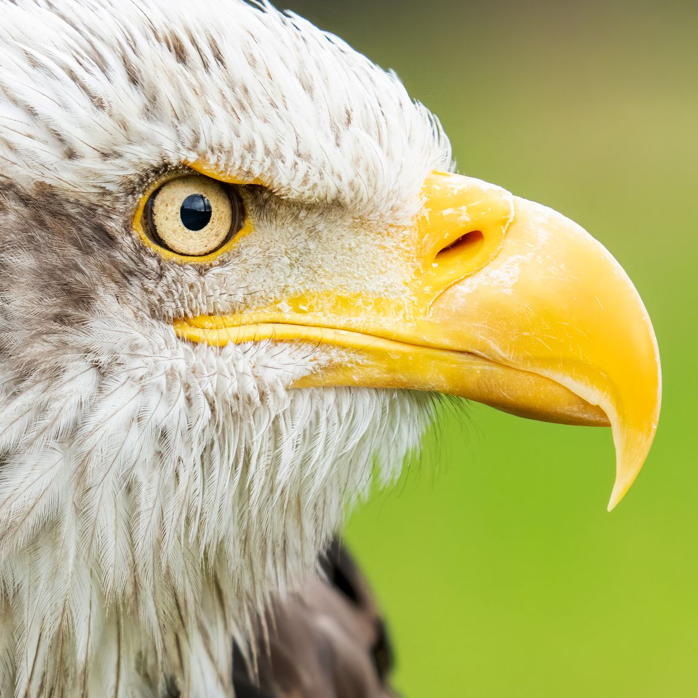

# Edge-Detection-Using-Convolutions

to use clone this project and add images to the same directory and run "run_ed.py" to generate edges folder

Image             |  Edges(all RGB Edges)
:-------------------------:|:-------------------------:
  |  
  |  
  |  
